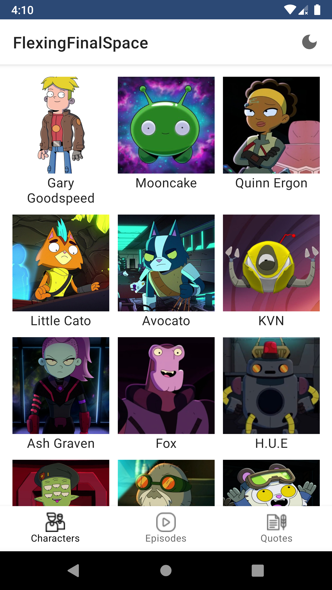

# FlexingFinalSpace
FlexingFinalSpace is an Android sample application created for learning purposes only.\
This application is based on [FinalSpaceAPI](https://finalspaceapi.com/) and provides information about characters, episodes and quotes of [Final Space](https://www.imdb.com/title/tt6317068/) series.

## Screenshots
### Light theme
<p float="left">
  
   
  
  
</p>

### Dark theme
<p float="left">
  
   
  
  
</p>

### Compose
<p float="left">
  
   
  
  
</p>

## Tech stack and concepts
* **[Kotlin](https://kotlinlang.org/)** as programming language.
* **[Kotlin coroutines](https://kotlin.github.io/kotlinx.coroutines/kotlinx-coroutines-core/)** as framework for asynchronous jobs (**[RxJava](https://github.com/ReactiveX/RxJava)** as its alternative (**/Dagger2+RxJava** branch)).
  * **Flow** (*StateFlow*) as dataholder for UI layer (**Livedata** as its alternative (**/Dagger2+RxJava** branch)).
* Single activity support.
  * **[Fragments](https://developer.android.com/jetpack/androidx/releases/fragment)**.
  * **[Navigation components](https://developer.android.com/jetpack/androidx/releases/navigation)**.
* **[Jetpack Compose](https://developer.android.com/jetpack/compose)** as modern declarative UI toolkit (**/compose** branch).
* Modern UI toolkit.
  * **[Material components](https://material.io/develop/android)**.
  * **ViewBinding** for binding .xml views to objects in Activities and Fragments.
* Api-based remote data layer.
  * **[Retrofit](https://square.github.io/retrofit/)** for network queries.
  * **[GSON](https://github.com/google/gson)** for parsing JSON.
* **[DataStore](https://developer.android.com/jetpack/androidx/releases/datastore)** for working with user preferences (e.g. light/dark theme).
* **[Room](https://developer.android.com/jetpack/androidx/releases/room)** for local data layer.
* Caching remote data using **NetworkBoundResource** pattern (by utilizing Room, Retrofit and Flow).
* **[Lifecycle components](https://developer.android.com/jetpack/androidx/releases/lifecycle)**.
  * **ViewModel** for implementing MVVM pattern.
* **[Glide](https://github.com/bumptech/glide)** and **[Coil](https://coil-kt.github.io/coil/)** for working with images.
* Testing.
  * **JUnit**.
  * **[Android testing library](https://developer.android.com/jetpack/androidx/releases/test)**.
  * **Espresso** for UI-testing.
  * **Mockito** for mocking third-party classes (e.g. *NavController*).
  * Specific testing artifacts for other libraries.
  * **Compose testing libraries**.
* **[Hilt](https://dagger.dev/hilt/)** for dependency injection (**[Dagger 2](https://dagger.dev/)** as its alternative (**/Dagger2+RxJava** branch)).

## Key features
#### i.e. what is unique among other samples?
* **Offline-first** approach implementation utilizing **NetworkBoundResource**
* **GridLayoutManager** for **RecyclerView**
* **BottomSheetDialog** implementation
* **Coil** as image-loading library for View system
* Espresso **ViewAssertion** for menu items

## Attribution
Icons:
* "Alive" and "Dead" icons made by [Pixel perfect](https://icon54.com/) from [Flaticon](https://www.flaticon.com/).
* "Episode" icon made by [Freepik](https://www.freepik.com) from [Flaticon](https://www.flaticon.com/).

## License
```
MIT License

Copyright (c) 2022 Shvyndia Andrii

Permission is hereby granted, free of charge, to any person obtaining a copy
of this software and associated documentation files (the "Software"), to deal
in the Software without restriction, including without limitation the rights
to use, copy, modify, merge, publish, distribute, sublicense, and/or sell
copies of the Software, and to permit persons to whom the Software is
furnished to do so, subject to the following conditions:

The above copyright notice and this permission notice shall be included in all
copies or substantial portions of the Software.

THE SOFTWARE IS PROVIDED "AS IS", WITHOUT WARRANTY OF ANY KIND, EXPRESS OR
IMPLIED, INCLUDING BUT NOT LIMITED TO THE WARRANTIES OF MERCHANTABILITY,
FITNESS FOR A PARTICULAR PURPOSE AND NONINFRINGEMENT. IN NO EVENT SHALL THE
AUTHORS OR COPYRIGHT HOLDERS BE LIABLE FOR ANY CLAIM, DAMAGES OR OTHER
LIABILITY, WHETHER IN AN ACTION OF CONTRACT, TORT OR OTHERWISE, ARISING FROM,
OUT OF OR IN CONNECTION WITH THE SOFTWARE OR THE USE OR OTHER DEALINGS IN THE
SOFTWARE.
```
